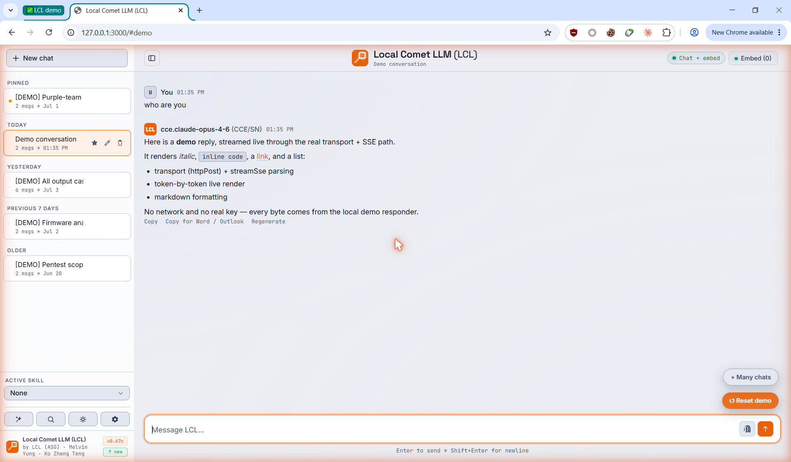

# Local Comet LLM (LCL)

A single-page chat app + lightweight Node.js proxy that lets Singapore
Government Comet machine users talk to GovTech PlatformAI through a local
browser interface at `http://localhost:3000`.

- **Audience:** non-technical CSA Comet users. Install once, use daily.
- **Footprint:** two files — `index.html` (the whole app) and `server.txt`
  (the proxy). No build tools or dependencies required to *run*.
- **Current version:** v0.67d — see [CHANGELOG.md](CHANGELOG.md) for history.
- **Install:** see the end-user [Setup Guide](docs/LCL_Setup_Guide.html).



---

## Features

- **Streaming chat** with full markdown rendering (tables, code blocks, lists)
  and one-click **Copy for Word / Outlook** that preserves formatting.
- **Chat over your files (RAG):** drop in `docx`, `pdf` (incl. OCR for scanned
  pages), `xlsx`, `pptx`, `html`, `txt` — files are chunked and embedded locally
  with a persistent embedding cache, and answers cite their source files.
- **Rate-limit aware by design:** the shared per-minute token window is paced
  proactively — large documents summarise via adaptive map-reduce, embeddings
  wait out 429s instead of failing, and long replies that hit the token cap get
  a **Continue** button that picks up exactly where they stopped.
- **Resilient:** automatic retries with visible countdowns for rate limits and
  transient upstream errors; mid-stream failures are detected and retried
  rather than silently truncating a reply.
- **Skills:** reusable system-prompt presets (e.g. report writer, code
  reviewer), manageable from the UI.
- **Self-updating:** stable and experimental update channels with checksum
  verification, switchable in Settings.

---

## How it works

```
Browser (index.html)  ──>  Node proxy (server.txt)  ──>  GovTech PlatformAI
   chat UI, RAG,            adds auth header, streams        chat + embeddings
   markdown, file work      responses, caches embeddings     (api.ai.tech.gov.sg)
```

- `index.html` is a self-contained SPA — HTML + CSS + JS in one file. It is
  **generated** from the modules in `src/` by `build.js`; do not edit it directly.
- `server.txt` is a zero-dependency Node script (run directly, not built). It
  proxies requests so the browser never holds the upstream connection, streams
  responses token-by-token, paces embedding against the API rate limit, and
  caches embedding vectors locally.

---

## Repository layout

| Path | What it is |
|---|---|
| `index.html` | The shipped app (generated — do not hand-edit). |
| `server.txt` | The Node proxy. Run this. |
| `src/` | Source modules assembled by `build.js`. |
| `build.js` | Concatenates `src/` into `index.html` + verification checks. |
| `test/` | Regression suites: `demo-api.test.js` (server) and `client-logic.test.js` (client logic in a vm sandbox). |
| `CHANGELOG.md` | Version history. |
| `docs/` | Setup guide, screenshots. |

Not committed (see `.gitignore`): `lcl_data.json` and `embed_cache.bin`
(runtime data/caches), backups, and internal working docs.

## For contributors

```bash
node build.js                     # regenerate index.html + verification checks
node test/demo-api.test.js        # server regression suite (boots the real proxy in-process)
node test/client-logic.test.js    # client-logic suite (real src modules, vm sandbox)
```

## Security notes

- No credentials are committed. API keys are supplied at runtime in the app UI
  (Connect) and saved only to the local, git-ignored `lcl_data.json`.
- Embedding vectors are cached locally in `embed_cache.bin` (git-ignored).
- The proxy binds to `127.0.0.1` only — not reachable from the LAN.

## Credits

Local Comet LLM (LCL) — CSA / ASG\
Contributors: Melvin Yung, Ko Zheng Teng.
